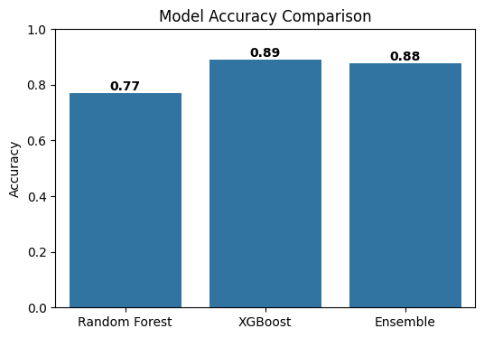

# 🌌 Exoplanet Hunter — Machine Learning Classification Project

This project applies **Machine Learning** techniques to classify potential **exoplanets** based on multiple observational parameters.
The system predicts whether a candidate is a **confirmed planet**, **false positive**, or **possible candidate**, using various supervised learning models.

🔗 **App Link:** [https://exoplanethunter.streamlit.app/](https://exoplanethunter.streamlit.app/)

---

## 🚀 Overview

The goal of this project is to:

- Perform **data cleaning** and **exploratory data analysis (EDA)**
- Apply **standard scaling** and preprocessing
- Train and evaluate **multiple ML models**
- Visualize model performance (confusion matrices)
- Save trained models for **future deployment**
- Integrate everything into an interactive **Streamlit web app**

🔗 **Live App:** [Exoplanet Hunter](https://exoplanethunter.streamlit.app/)

---

## 📊 Dataset

📂 **Dataset Source:**
[TESS NASA Dataset ](https://exoplanetarchive.ipac.caltech.edu/cgi-bin/TblView/nph-tblView?app=ExoTbls&config=TOI)*

---

## ⚙️ Workflow

1. **Data Cleaning** – handled missing values and data type inconsistencies
2. **Exploratory Data Analysis (EDA)** – visualized distributions and correlations
3. **Feature Scaling** – applied `StandardScaler` to normalize input features
4. **Model Training** – used multiple supervised ML algorithms
5. **Model Evaluation** – analyzed performance via accuracy, F1-score, and confusion matrices

---

## 📉 Confusion Matrices

### 🔹 XGBoost

---

## 🧩 Trained Models

📸 *Model Files Overview:*

---
